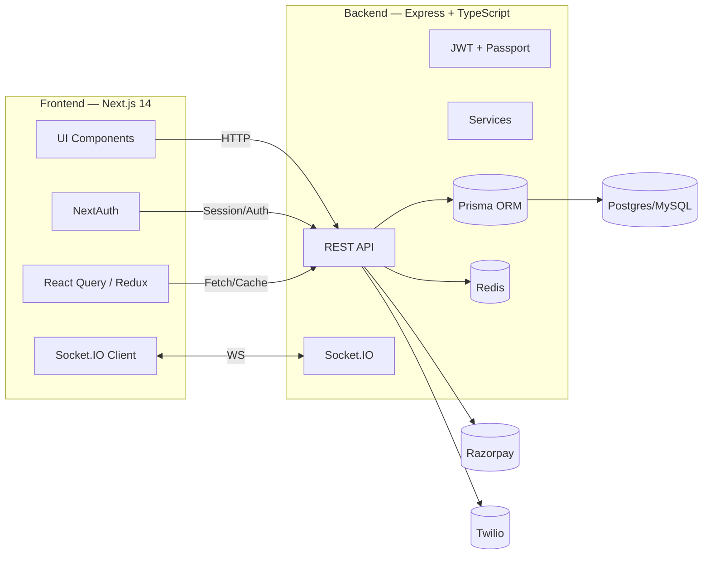

# Acadevia — Gamified Learning Platform

[](LICENSE)


A modern, modular, and engaging learning platform with real‑time progression, badges, and leaderboards.

---

## Table of Contents
- [Overview](#overview)
- [Architecture](#architecture)
- [Features](#features)
- [Tech Stack](#tech-stack)
- [Repository Structure](#repository-structure)
- [Quickstart](#quickstart)
  - [Backend](#backend)
  - [Frontend](#frontend)
- [Environment Variables](#environment-variables)
- [Scripts](#scripts)
- [API & Sockets](#api--sockets)
- [Development Notes](#development-notes)
- [Deployment](#deployment)
- [Contributing](#contributing)
- [License](#license)

---

## Overview
Acadevia brings gamification to education: interactive lessons, quizzes with dynamic feedback, achievements, and real‑time collaboration to boost learner motivation and outcomes.

## Architecture



## Features
- Authentication and profiles (NextAuth on the frontend; JWT/Passport on the backend)
- Interactive lessons, quizzes, and dynamic feedback
- Badges, achievements, and leaderboards
- Real‑time progress and collaboration via WebSockets
- Modular course design and analytics dashboards
- Mobile‑responsive UI with Tailwind and MUI
- Integrations: Razorpay (payments), Twilio (notifications)

## Tech Stack

| Layer     | Technologies |
|-----------|--------------|
| Frontend  | Next.js 14, TypeScript, TailwindCSS, MUI, NextAuth, React Query, Redux Toolkit, Chart.js, Framer Motion, Lucide Icons, Socket.IO client |
| Backend   | Node.js, Express, TypeScript, Prisma, Passport JWT, Redis, Socket.IO, Razorpay, Twilio, AWS SDK |
| Database  | Prisma ORM (Postgres/MySQL via `DATABASE_URL`) |
| Tooling   | ESLint, Jest (backend), Tailwind plugins, Prettier (inferred) |

## Repository Structure

```
Acadevia-3/
├─ frontend/                  # Next.js 14 app (primary UI)
│  ├─ src/                    # Routes, components, features
│  ├─ public/                 # Static assets
│  ├─ next.config.js
│  ├─ tailwind.config.js
│  ├─ package.json
│  └─ ... (tsconfig, postcss, etc.)
├─ backend/                   # Express + TS API
│  ├─ src/
│  │  ├─ app.ts               # Express app
│  │  ├─ server.ts            # Bootstraps server & sockets
│  │  ├─ routes/              # API routes
│  │  ├─ controllers/         # Controllers
│  │  ├─ services/            # Business logic
│  │  ├─ sockets/             # Socket.IO events
│  │  ├─ middlewares/         # Auth, validation, etc.
│  │  ├─ validations/         # Joi/Zod schemas
│  │  └─ utils/               # Helpers
│  ├─ prisma/                 # Prisma schema & seed
│  ├─ tsconfig.json
│  ├─ package.json
│  └─ Dockerfile              # Placeholder; extend as needed
└─ README.md
```

## Quickstart

### Backend
```bash
cd backend
cp .env.example .env   # create and fill if example is empty
npm install

# Prisma
npm run generate
npm run migrate        # or: npx prisma migrate dev
# optional: seed
npm run seed

# Dev server
npm run dev
```
Common backend env:
- `DATABASE_URL=`
- `JWT_SECRET=`
- `REDIS_URL=`
- `RAZORPAY_KEY_ID=` / `RAZORPAY_KEY_SECRET=`
- `TWILIO_ACCOUNT_SID=` / `TWILIO_AUTH_TOKEN=` / `TWILIO_PHONE_NUMBER=`
- `AWS_ACCESS_KEY_ID=` / `AWS_SECRET_ACCESS_KEY=` / `AWS_REGION=`
- `PORT=4000`
- `CORS_ORIGIN=http://localhost:3000`

### Frontend
Open a second terminal:
```bash
cd frontend
cp .env.local.example .env.local   # create and fill if example is empty
npm install
npm run dev
```
Common frontend env:
- `NEXT_PUBLIC_API_URL=http://localhost:4000`
- `NEXT_PUBLIC_SOCKET_URL=http://localhost:4000`
- `NEXTAUTH_URL=http://localhost:3000`
- `NEXTAUTH_SECRET=your_long_random_string`
- `NEXT_PUBLIC_RAZORPAY_KEY_ID=`

Open http://localhost:3000 to view the app.

## Environment Variables

| App      | Key                                 | Description |
|----------|--------------------------------------|-------------|
| Backend  | DATABASE_URL                          | Prisma DB connection string |
| Backend  | JWT_SECRET                            | JWT signing secret |
| Backend  | REDIS_URL                             | Redis connection (optional) |
| Backend  | RAZORPAY_KEY_ID / RAZORPAY_KEY_SECRET | Payment integration |
| Backend  | TWILIO_*                              | SMS/notification credentials |
| Backend  | AWS_*                                 | S3 or other AWS services |
| Frontend | NEXT_PUBLIC_API_URL                   | Base URL of backend API |
| Frontend | NEXT_PUBLIC_SOCKET_URL                | Socket.IO URL |
| Frontend | NEXTAUTH_URL                          | NextAuth site URL |
| Frontend | NEXTAUTH_SECRET                       | NextAuth secret |

## Scripts

Frontend (from `frontend/`):
- `dev`: next dev
- `build`: next build
- `start`: next start
- `lint`: next lint

Backend (from `backend/`):
- `dev`: nodemon src/server.ts
- `build`: tsc
- `start`: node dist/server.js
- `migrate`: npx prisma migrate dev
- `generate`: npx prisma generate
- `seed`: ts-node prisma/seed.ts
- `test`: jest

## API & Sockets
- REST API under `backend/src/routes` with controllers in `backend/src/controllers`
- Auth: JWT with Passport (backend); NextAuth (frontend)
- Real‑time: Socket.IO (`backend/src/sockets`) with Socket.IO client in the frontend
- Validation: Joi/Zod under `backend/src/validations`

> Want a Swagger/OpenAPI spec? We can add it in a follow‑up PR.

## Development Notes
- Code style: ESLint + Tailwind plugin (frontend); Prettier (inferred)
- Database: Prisma Studio for inspection — `npx prisma studio`
- Testing: Backend uses Jest — `npm test`
- Docker: Backend Dockerfile/docker-compose are stubs — extend for production

## Deployment
- Frontend: Vercel or any Node host (Next.js 14)
- Backend: Any Node host or Docker
- Database/Redis: Managed providers (Neon/Planetscale/Supabase; Upstash/Redis Cloud)

## Contributing
1. Fork the repo
2. Create a feature branch: `git checkout -b feature/awesome`
3. Commit: `git commit -m "feat: add awesome"`
4. Push: `git push origin feature/awesome`
5. Open a PR

## License
MIT
